### 作者QQ：1556708905(支持修改、 部署调试、 支持代做毕设)

#### 支持代做任何毕设论、接网站建设、小程序、H5、APP、各种系统等

**毕业设计所有选题地址 [https://github.com/zhengjianzhong0107/allProject](https://github.com/zhengjianzhong0107/allProject)**

**博客地址：[https://blog.csdn.net/2303_76227485/article/details/128704679](https://blog.csdn.net/2303_76227485/article/details/128704679)**

**视频演示：[https://www.bilibili.com/video/BV1Mk4y1T7mL/](https://www.bilibili.com/video/BV1Mk4y1T7mL/)**

## 基于Java的蛋糕商城管理系统

## 一、系统介绍

本项目分为前后台，分为管理员与普通用户两种角色，管理员登录后台，普通用户登录前台；
管理员角色包含以下功能：
管理员登录,商品管理,订单管理,客户管理,类目管理等功能。

用户角色包含以下功能：
首页,商品分类,热销和新品,注册新用户,用户登录,查看个人中心,购买商品,查看购物车,提交订单,模拟支付成功,查看订单等功能。

## 二、所用技术

SSM+JSP+CSS+jQuery+bootstrap+mysql

## 三、环境介绍

基础环境 :IDEA/eclipse, JDK 1.8 , Mysql, 

源码+数据库脚本 

所有项目以及源代码本人均调试运行无问题 可支持远程调试运行

## 四、页面截图

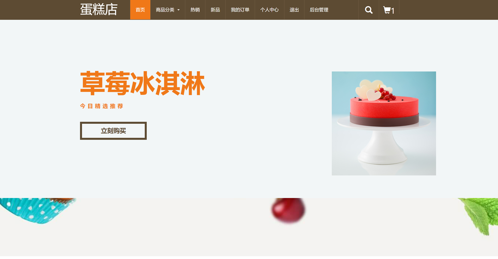

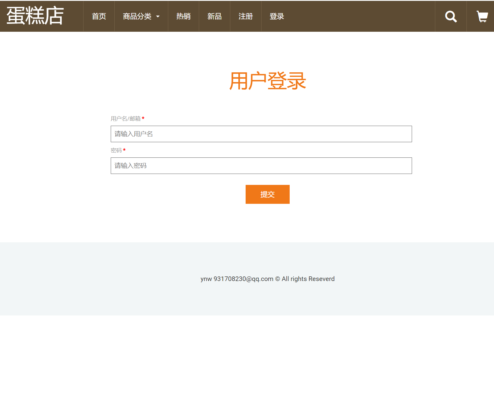

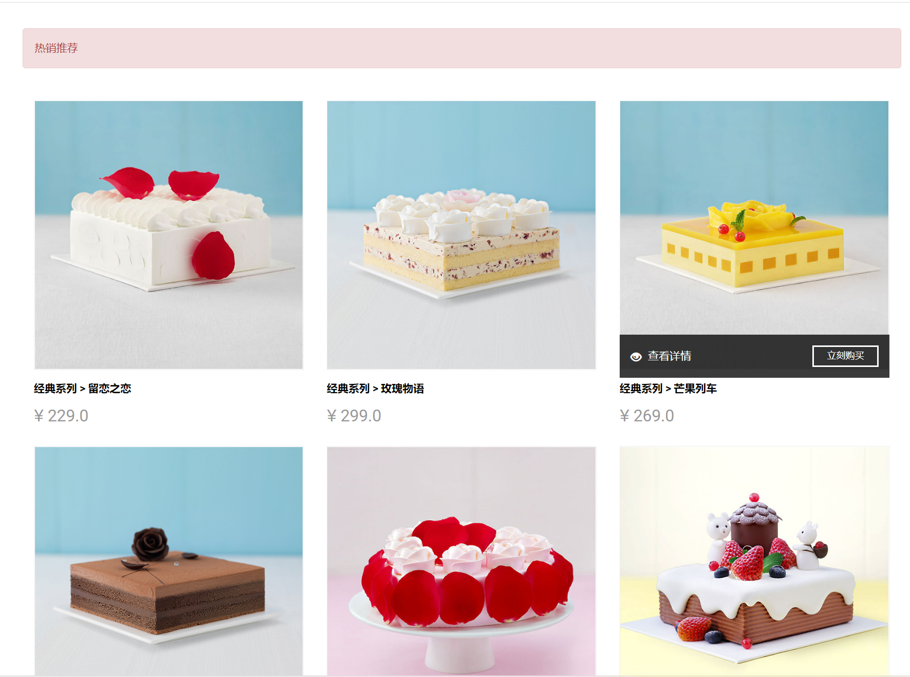

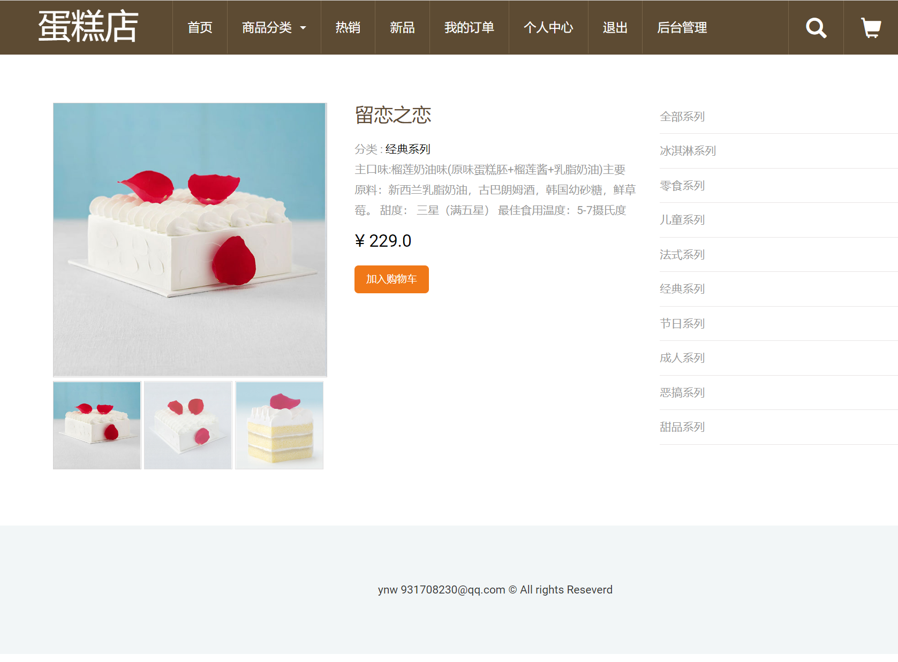

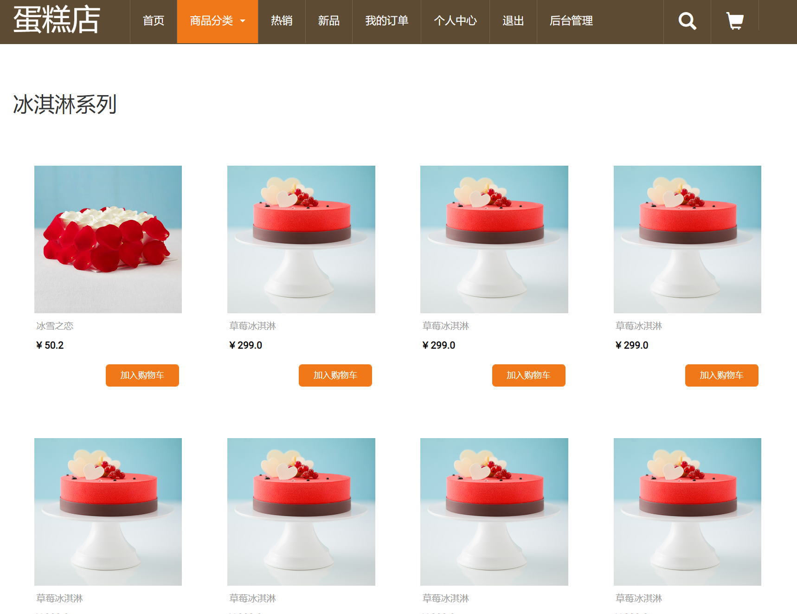

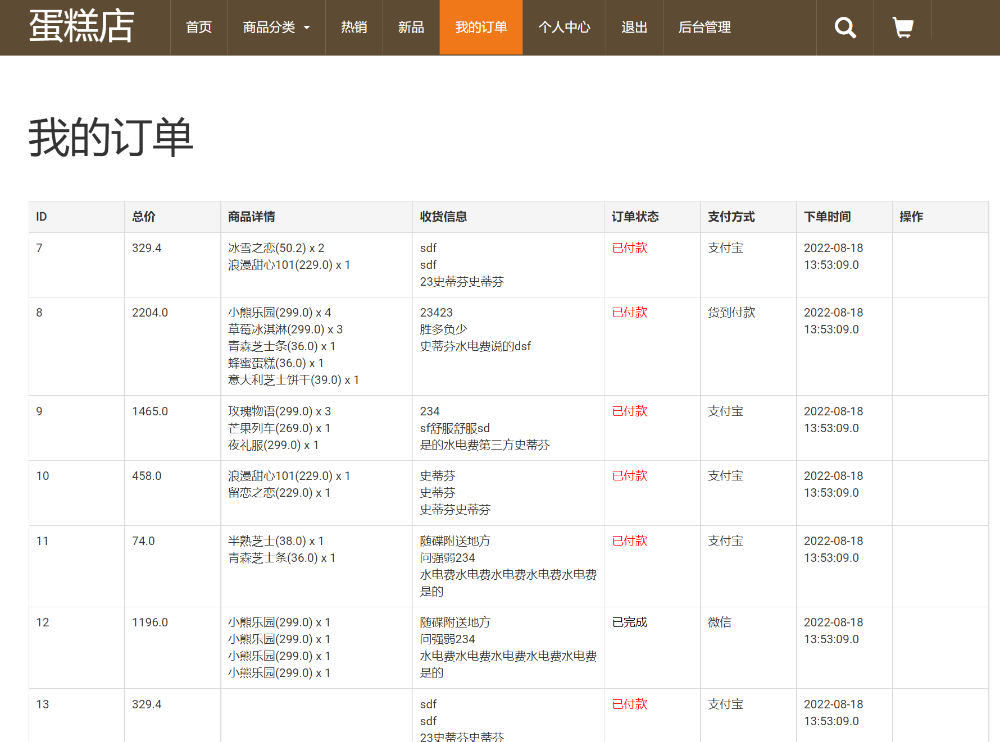

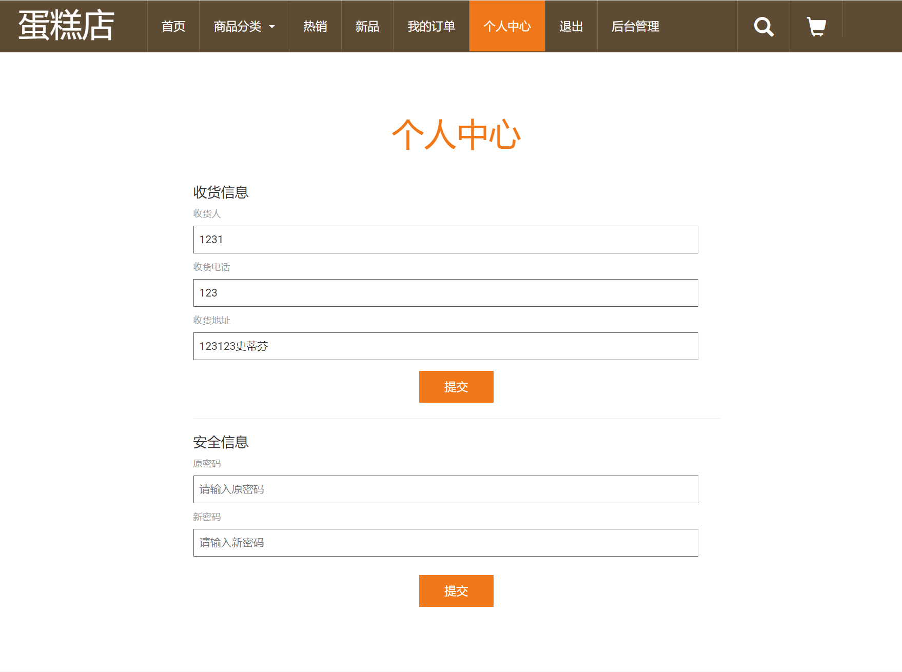

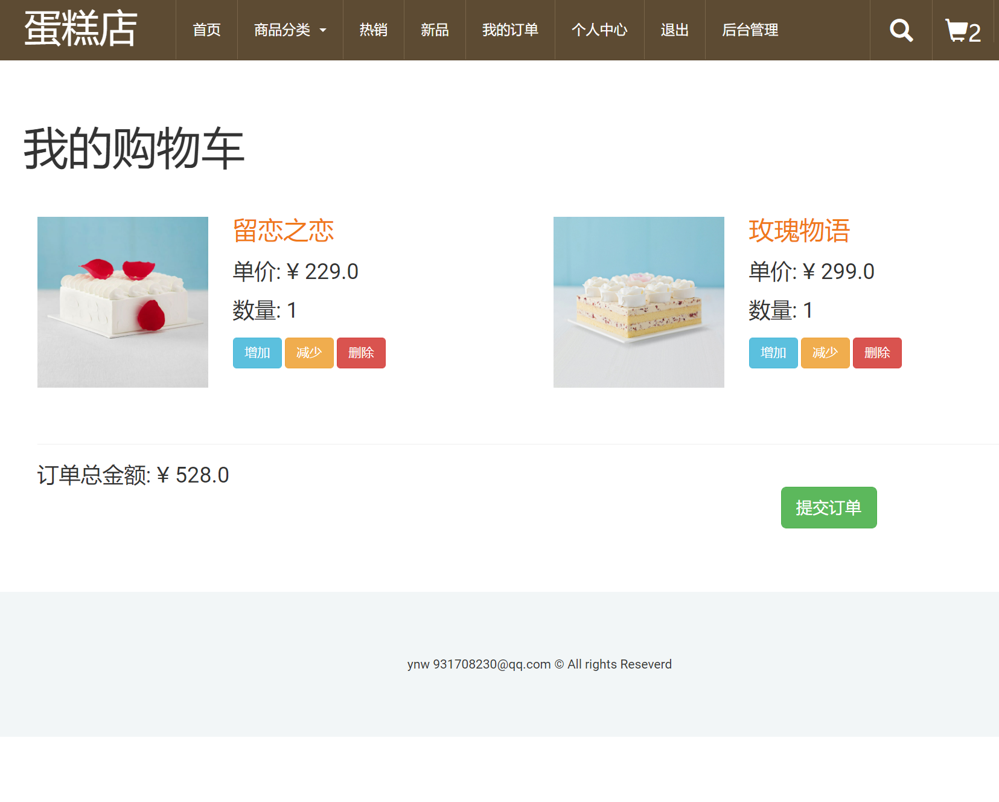

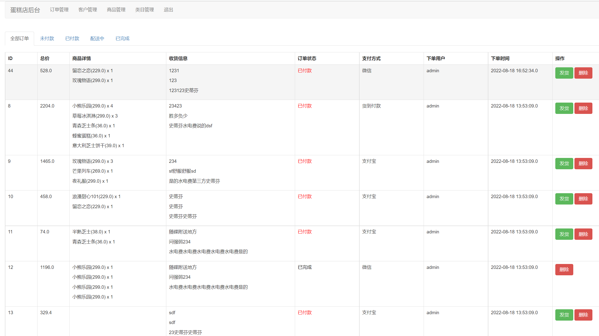

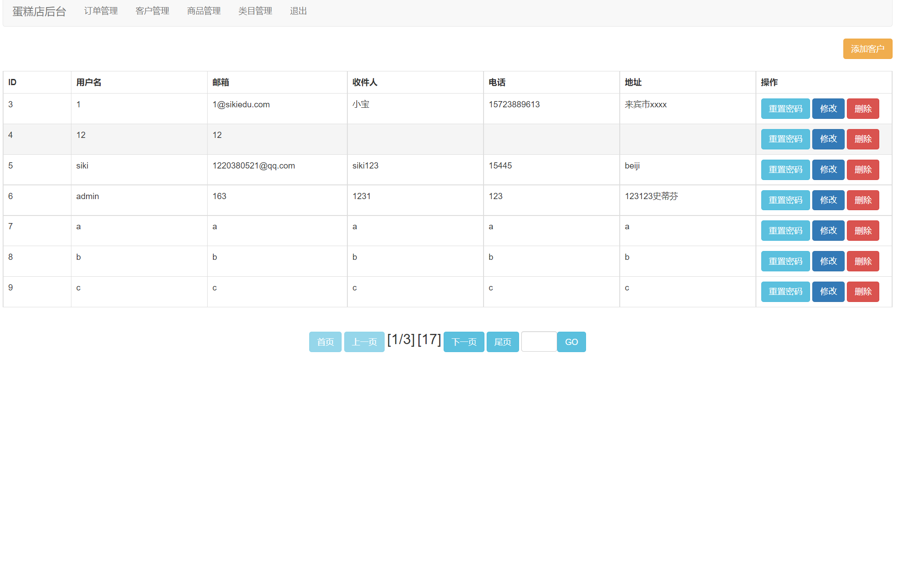

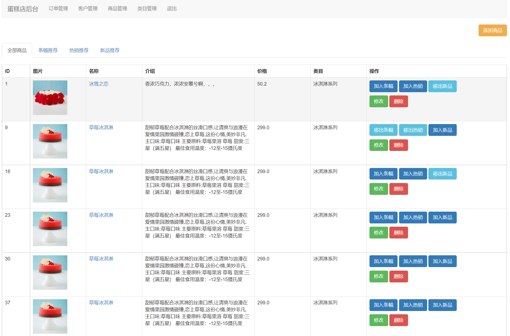

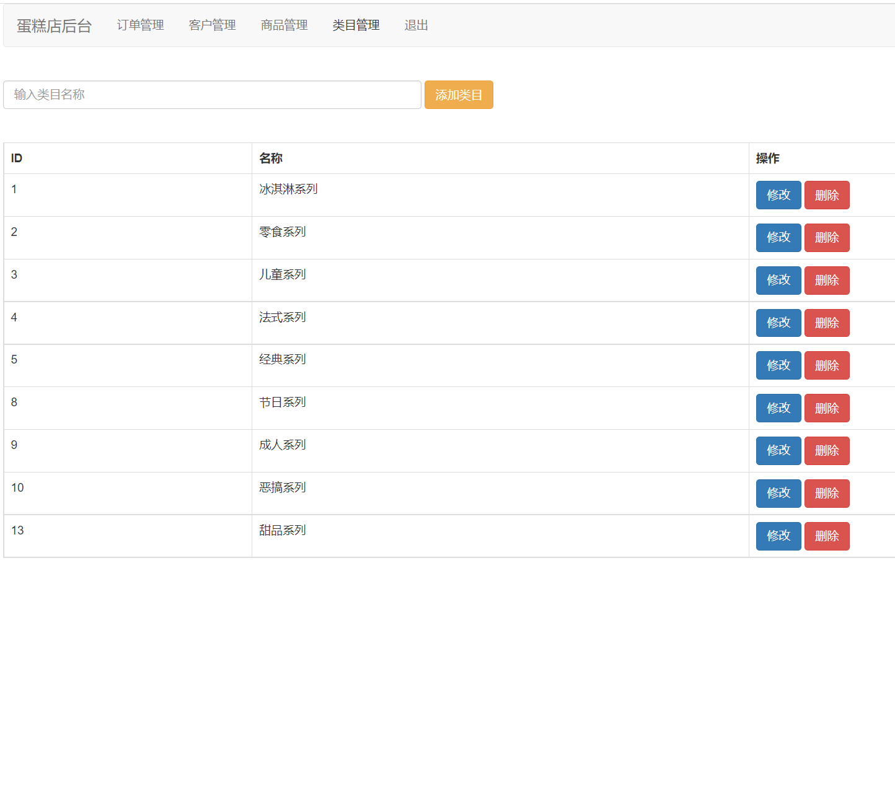

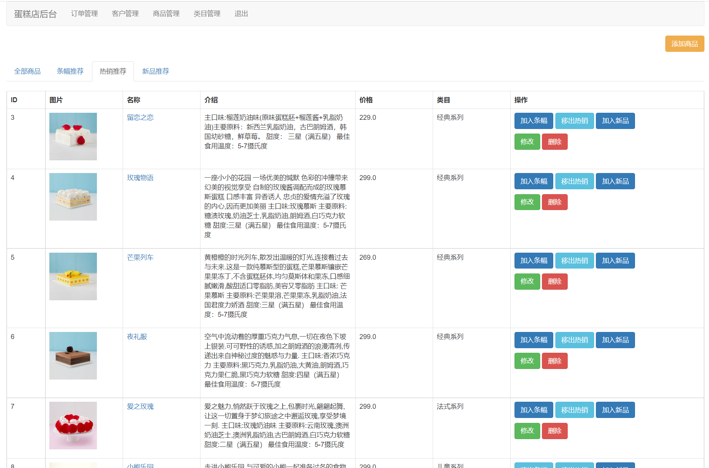

## 五、浏览地址

前端访问地址：localhost:8989/cakeshop/

用户账号/密码：siki/123

管理员账号/密码：admin/admin  管理员账号登录后可以看到管理后台

## 六、安装教程

1. 使用Navicat或者其它工具，在mysql中创建对应名称的数据库，并导入项目的sql文件；
2. 使用IDEA/Eclipse/MyEclipse导入项目，Eclipse/MyEclipse导入时，若为maven项目请选择maven;
   
   若为maven项目，导入成功后请执行maven clean;maven install命令，然后运行；
3. 将项目中c3p0-config.xml配置文件中的数据库配置改为自己的配置;
4. 运行项目，输入localhost:8989/cakeshop/ 登录
   
   注：tomcat中配置项目路径必须为cakeshop，否则会有异常；

 
